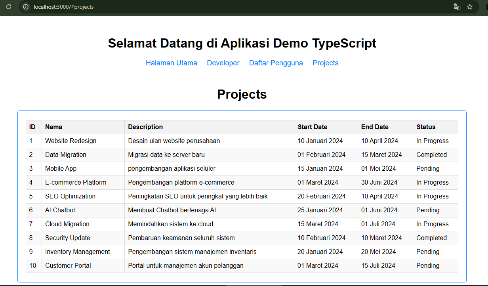

# TS Frontend - Fullstack Project with Javagenz

## 📋 Project Overview

Frontend ini adalah bagian dari proyek fullstack yang dikembangkan menggunakan TypeScript, Axios, dan Webpack. Frontend ini berinteraksi dengan API backend (dibangun dengan .NET 8 dan PostgreSQL), menampilkan data secara dinamis, dan mendukung operasi CRUD untuk entitas seperti Developers dan Projects. Silahkan kunjungi repository untuk [Backend](https://github.com/tkarombang/Backend_API-PostgreSQL_dotnet-8)

---

## 🛠️ Technologies Used

### **1. TypeScript**

- **Purpose:** Digunakan untuk memberikan tipe statis pada JavaScript, memudahkan debugging, dan meningkatkan kualitas kode.
- **Key Features:**
  - Dikonfigurasi dengan `tsconfig.json` untuk strict mode dan modul berbasis ESNext.
  - File utama menggunakan ekstensi `.ts`.

### **2. Axios**

- **Purpose:** Untuk melakukan HTTP request ke API backend.
- **Key Features:**
  - Digunakan di file seperti `apiServiceProj.ts` untuk operasi CRUD pada data Projects.
  - Mendukung query parameter seperti `page` dan `pageSize`.

### **3. Webpack**

- **Purpose:** Untuk membundel modul TypeScript, CSS, dan file lain menjadi satu output yang dapat digunakan di browser.
- **Key Features:**
  - Menggunakan loader seperti `ts-loader`, `css-loader`, dan `style-loader`.
  - Plugin `html-webpack-plugin` untuk menghasilkan file HTML secara dinamis.

---

## 🚀 Getting Started

### Prerequisites

1. **Node.js** - Unduh dan install dari [Node.js](https://nodejs.org/).
2. **npm** - Sudah termasuk saat Anda menginstall Node.js.
3. **Browser** - Untuk mengakses aplikasi frontend.

### Installation Steps

1. **Clone the Repository:**
   ```bash
   git clone https://github.com/tkarombang/Frontend_TS_Fullstack.git
   cd Frontend_TS_Fullstack
   ```
2. **Install Dependencies:**

```bash
npm install
```

3. **Configure API Endpoint:**
   - Pastikan URL API pada parameter `apiUrl` sudah sesuai di constructor `ApiServiceProj` pada file `src/projects/apiServiceProj.ts`. Contohnya:
     ```typescript
     const apiService = new ApiServiceProj("http://localhost:5020/api");
     ```
   - Anda bisa mengubah URL tersebut agar sesuai dengan endpoint API yang Anda gunakan.
4. **Run in Development Mode:**

```bash
npm run serve
```

### Tampilan Halaman Frontend

Berikut adalah tampilan halaman frontend yang menunjukkan daftar proyek yang diambil dari API:



### Fitur Utama

- **Backend**: API berbasis C# ASP.NET Core dengan database PostgreSQL.
- **Frontend**: Aplikasi TypeScript untuk menampilkan data proyek dengan tabel interaktif.
- **Swagger**: Dokumentasi API yang interaktif dan mudah digunakan.

5. \*_Build for Production_:\*

```bash
npm run build
```

---

## 📚 Project Structure

```bash
src/
├── app.ts
├── router.ts
├── developer/
│   ├── apiServiceDev.ts
│   ├── listdev.ts
│   ├── developersPage.ts
├── projects/
│   ├── apiServiceProj.ts
│   ├── listProject.ts
│   ├── projectPage.ts
├── users/
│   ├── users.ts
├── welcome.ts
├── css/
│   ├── ......css
│   ├── ....css
│   ├── ...css
```

### Explanation:

- app.ts: Entry point aplikasi, menginisialisasi router dan halaman utama.
- router.ts: Mengelola navigasi antar halaman.
- developer/: Berisi fitur terkait pengembang,termasuk API service dan halaman daftar.
- projects/: Berisi fitur terkait proyek, termasuk API service dan halaman daftar.
- users/: Mengelola fitur terkait pengguna.
- css/: ......

---

## 🌐 Application Features

### Dynamic Routing

- Menggunakan router sederhana yang diinisialisasi di app.ts untuk navigasi antar halaman.

### Projects Management

- API Calls: Menggunakan axios untuk fetch data dari backend.
- Pagination Support: Mendukung pagination melalui query parameter page dan pageSize.
- Data Display: Data ditampilkan dalam tabel HTML yang dinamis.

### Modular Code Structure

- Setiap fitur dipisahkan ke dalam modul independen untuk meningkatkan keterbacaan dan pemeliharaan.

---

## 🧪 Testing

- Pengujian dilakukan secara manual dengan menjalankan aplikasi di browser dan memeriksa interaksi data dengan API backend.
- Anda juga dapat menggunakan Postman untuk memverifikasi respons API backend.

---

## 🚀 Deployment (Belum Dilakukan)

1. Build the project using:

```bash
  npm run build
```

2. Deploy folder dist ke layanan hosting seperti Vercel, Netlify, atau AWS S3

---

## Key Scripts

- Start development server: npm run serve
- Build for production: npm run build
- Watch TypeScript changes: npm run dev

---

## 🧑‍💻 Author

Muhammad Azwar Anas - [Linkedin](https://www.linkedin.com/in/muhanaz) | [GitHub](https://github.com/tkarombang)
